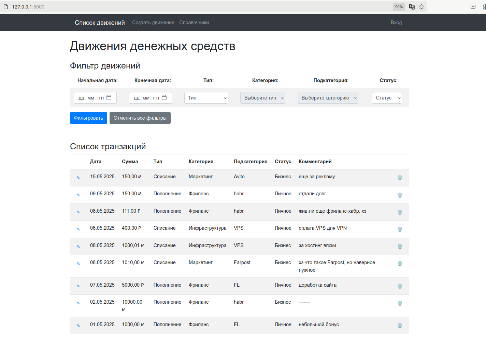

Используется менеджер пакетов poetry

Для проверки, клонировать репозиторий:

    git clone https://github.com/VasyaPupkin120/test_itsolutions.git

Перейти в директорию test_itsolutions, в ней запустить шелл poetry:

    poetry shell

Запустить установку зависимостей:

    poetry install

Запустить веб-сервер Django:

    python3 manage.py runserver

Для доступа к админке под учетной записью суперпользователя можно использовать логин и пароль:

    test
    test

Скриншот главной странички:

